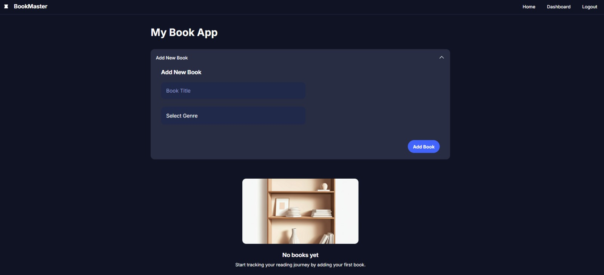

📚 Books Manager App
Aplicación web para gestionar libros por género y estado. Incluye autenticación con JWT, rutas protegidas, manejo global de estado con hooks personalizados y estilos modernos. Construida con React, Vite y React Router DOM.

🚀 Requisitos Previos
Node.js >= 16.x

npm >= 7.x

Backend compatible corriendo en: http://localhost:2222/api/books

## 📸 Vista previa



### 📦 Demo

Accedé a la aplicación funcionando en el siguiente enlace:

🔗 [react-book-app-67gs.vercel.app/](https://react-book-app-67gs.vercel.app/)

⚙️ Instalación
Cloná el repositorio y navegá a la carpeta del frontend:


git clone <url-del-repo>
cd frontend
Instalá las dependencias:


npm install
📦 Scripts disponibles
```bash
npm run dev: Levanta el entorno de desarrollo con Vite.

npm run build: Compila el proyecto para producción.

npm run preview: Previsualiza el build de producción.

npm run lint: Analiza el código con ESLint.
```

🌐 Variables de entorno
Creá un archivo .env con las siguientes variables:
```bash
VITE_NODE_ENV=development
VITE_BASE_API_URL=http://localhost:2222/api
🗂 Estructura del Proyecto
```
```
src/
├── components/        → Componentes reutilizables (Books, Navbar, Checkbox, etc.)
├── context/           → AuthContext para JWT y sesión de usuario
├── hooks/             → Custom hook: useBooks() para manejar estado global
├── pages/             → Vistas principales (Login, Register, Dashboard, etc.)
├── router/            → Rutas protegidas y públicas
├── services/          → api.js: Lógica de peticiones al backend
└── index.css          → Estilos globales y responsive
```
✅ Funcionalidades Clave
🔐 Autenticación JWT: Registro e inicio de sesión protegidos. El token se guarda en localStorage y se usa para consumir la API.

📖 Gestión de libros: Crear, listar, editar, completar (checkbox de lectura) y eliminar libros.

🧠 Estado global con custom hook: useBooks() maneja el estado de los libros en toda la app.

🧩 Componentes modulares: Cada libro es un componente separado (<Books />) que recibe props y dispara acciones sin romper el estado global.

🎨 Estilos dinámicos: Los checkboxes reflejan cambios en tiempo real con estilos actualizados.

🔐 Rutas protegidas: Usuarios no autenticados no pueden acceder a Dashboard ni a la gestión de libros.

✍️ Uso
Asegurate de que el backend esté levantado y escuche en la URL configurada.

Iniciá la app:


npm run dev
Accedé a http://localhost:5173 desde tu navegador.

Registrate o logueate, y comenzá a gestionar tus libros por nombre y género 📚.

👨‍💻 Créditos
Desarrollado para proyecto final de la capacitación dada por Darwoft.